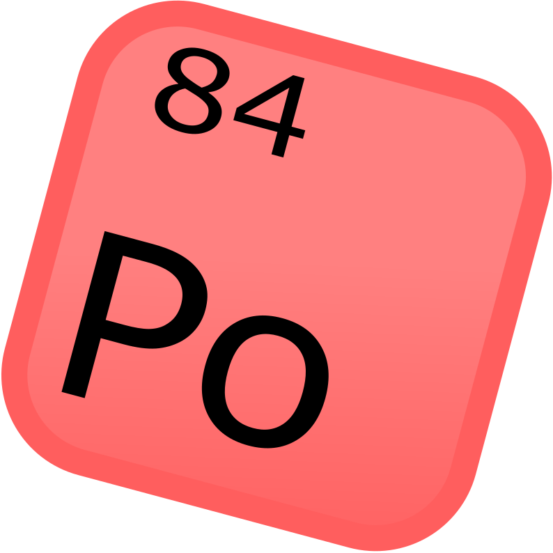

# polonium



```
local syspath inclusion "basiclib.po";

local method main(basic.string[] args) -> iauto
{
    io.out("Open Source Compiled Programming Language\n");
    return 0;
}
```

## What is Polonium?

as discussed before, Polonium is a compiled programming language, with the compiler being programmed in C++20.

Here is some basic syntax for an input program:

```
local syspath inclusion "basiclib.po";

local method main(basic.string[] args) -> iauto
{
    local var<basic.string> x;

    io.out("Input some text...");
    io.in(x, io.input.stream);
    io.out(x);
    return 0;
}
```

Polonium is also OOP, but unlike most OOP languages, you can take the OOP out of your life. (because we all know ***SOMEBODY*** hates OOP), so you don't need classes to make your code functioning... (java...)
```
local syspath inclusion "basiclib.po";

global class Foo1
{
    // inlined function
    global inl constructor Foo1()
    {
        io.out("CONSTRUCTOR");
    }

    global method bark() -> void
    {
        io.out(baseBark("Hi!"));
    }

    local method baseBark(const string msg) -> basic.string
    {
        return "Woof! " + msg;
    }
}

// or you can use structs... (barebones version of classes)

global struct Foo2
{
    var<i64> test;
}
```

That's all for now, because Polonium is in WIP state right now. Check back later!